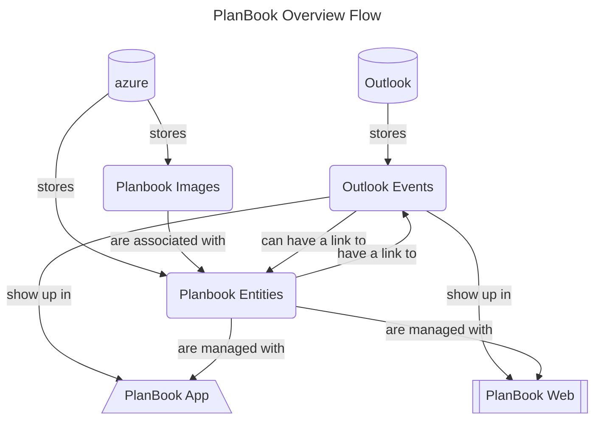

```mermaid
---
title: PlanBook Overview Flow
---
flowchart TD
    outlook[(Outlook)]
    app[/PlanBook App\]
    web[[PlanBook Web]]
    azure[(azure)]
    oe(Outlook Events)
    pbe(Planbook Entities)
    pbi(Planbook Images)
    azure-- stores --> pbe
    azure-- stores --> pbi
    pbi-- are associated with --> pbe
    outlook-- stores -->oe
    oe-- show up in --> app
    oe-- show up in --> web
    pbe-- are managed with --> app
    pbe-- are managed with --> web
    oe-- can have a link to --> pbe
    pbe-- have a link to --> oe

```
