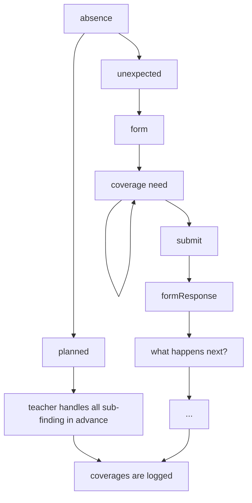

```mermaid
graph TD
    absence
    absence --> planned
    absence --> unexpected 
    planned --> teacherHandles[teacher handles all sub-finding in advance]
    teacherHandles --> log[coverages are logged]
    unexpected --> form
    form --> need[coverage need]
    need --> need
    need --> submit
    submit --> formResponse
    formResponse --> next[what happens next?]
    next --> unknownFlow[...]
    unknownFlow --> log
```
